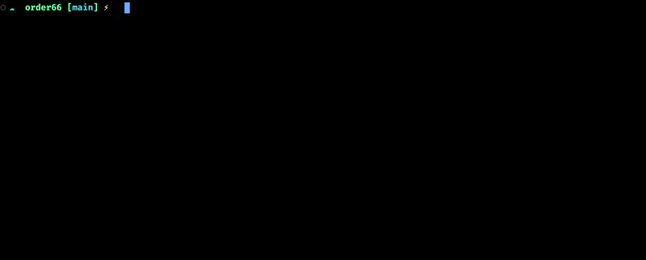

# Story - AI-Powered Task Management for Developers

Story is a CLI tool that helps developers manage their tasks by generating actionable steps from user stories using AI ([provider independent](#ai-model-configuration)). It maintains project context and tracks progress through user stories and tasks.

## Features

-   🧠 AI-powered task generation from user stories
-   📝 Maintains project context (language, framework, role, description)
-   ✅ Tracks task completion status
-   💾 Persistent storage of project data per repository
-   🎯 Focus on the next actionable task

<!-- Image -->



## Installation

1. Clone the repository:

    ```bash
    git clone https://github.com/baswilson/story.git
    ```

2. Install dependencies:

    ```bash
    go mod download
    ```

3. Create a `.env` file with your OpenAI (or [different provider's](#ai-model-configuration) key) API key:

    ```env
    AI_API_KEY=your-api-key-here
    ```

4. Build the project:

    ```bash
    go build -o story cmd/tool/main.go
    ```

5. Run the tool:

    ```bash
    ./story
    ```

6. (Optional) Add to your shell profile:
   Add an alias and `AI_API_KEY` to your shell profile for global access:
    ```bash
    nano ~/.zshrc
    ```
    Add these lines:
    ```bash
    export AI_API_KEY=your-key
    alias story="/Path/To/Your/Executable/story"
    ```

## Usage

### Commands

| Command               | Description                                                         |
| --------------------- | ------------------------------------------------------------------- |
| `set-context`         | Set project context (language, framework, role, description)        |
| `new-story`           | Add a new user story and generate tasks                             |
| `next-task`           | Show the next incomplete task for the active story                  |
| `complete-task [idx]` | Mark the current or specific task as complete (optional task index) |
| `status`              | Show the current user story and next task                           |
| `help`                | Show the help menu                                                  |

### Example Workflow

1. Set your project context:

    ```bash
    story set-context
    ```

2. Add a new user story:

    ```bash
    story new-story
    ```

3. Check your next task:

    ```bash
    story next-task
    ```

4. View current task/story:

    ```bash
    story
    ```

5. Complete current task:

    ```bash
    story complete-task
    ```

6. Complete a specific task:

    ```bash
    story complete-task 2
    ```

7. Check progress:
    ```bash
    story status
    ```

## AI Model Configuration

You can use different OpenAI API-compatible AI models by setting environment variables:

| Variable      | Description      | Default Value               |
| ------------- | ---------------- | --------------------------- |
| `AI_API_BASE` | API endpoint URL | `https://api.openai.com/v1` |
| `AI_MODEL`    | Model name       | `gpt-4o-2024-11-20`         |

### Supported Providers

| Provider | `AI_API_BASE`                 |
| -------- | ----------------------------- |
| Deepseek | `https://api.deepseek.com/v1` |
| OpenAI   | `https://api.openai.com/v1`   |

## Data Storage

All project data is stored in `memory.json` in the current working directory. This includes:

-   Project context
-   User stories
-   Task status
-   Next story ID

This allows easy inclusion of stories in source control.

## Requirements

-   Go 1.22.2 or higher
-   OpenAI API key (GPT-4 access recommended)

## Contributing

Contributions are welcome! Please open an issue or submit a pull request.

## License

MIT License
